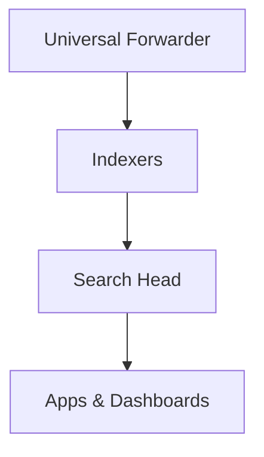
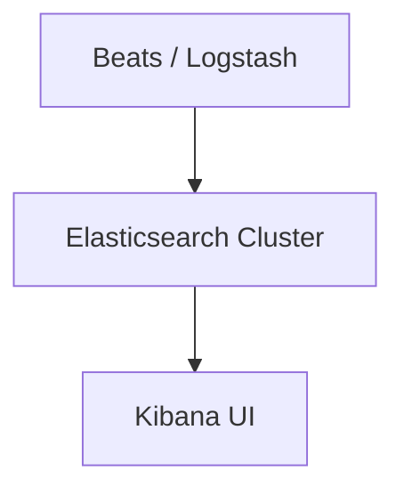

## Introduction

In this comprehensive walkthrough, we’ll compare **Splunk** and **Elastic Stack** from the lens of a detection engineer. This isn’t just a theoretical breakdown — it’s grounded in real-world workflows, SOC analyst perspectives, and architecture-level decisions.

---

# 1. Philosophy and Ecosystem

|              | **Splunk**                             | **Elastic Stack**                         |
|--------------|-----------------------------------------|-------------------------------------------|
| Origin       | Built for search/log indexing           | Originally a search engine (Elasticsearch)|
| License      | Commercial/Enterprise                   | Open Core (Open Source + Paid Features)   |
| Community    | Commercial-heavy, with robust support   | Massive OSS developer community           |

#
---
# Splunk vs Elastic Stack

## 2. Architecture

### Architecture Comparison

#### Splunk Stack

#### Elastic Stack

## 3. Detection Engineering

| Feature          | Splunk (Enterprise Security) | Elastic Stack (Elastic Security) |
|------------------|-------------------------------|-----------------------------------|
| **Rule Language** | SPL (Search Processing Language) | KQL, Lucene, YAML (via Elastic Rules) |
| **Scheduled Alerts** | Supported | Supported |
| **Detection-as-Code** | Limited (via SOAR or APIs) | Native via detection rules YAML & GitOps |
| **Threat Intel Matching** | Supported via ES / Splunk Add-ons | Built-in via `threat.indicator.*` fields |

**Splunk** excels at ad hoc queries and anomaly detection via SPL and MLTK.  
**Elastic** emphasizes _detection-as-code_, enabling CI/CD-style rule deployments.

## 4. Machine Learning & Analytics

- **Splunk**: Offers MLTK, pre-trained models, anomaly detection, and guided modeling.
- **Elastic**: Native ML for anomaly detection, regression, outlier detection (paid tiers).
> ℹ️ **Note**: Elastic ML is limited unless you’re on the **Platinum** or **Enterprise** tier[^1].

[^1]: [Elastic ML licensing tiers](https://www.elastic.co/subscriptions)

## 5. SOAR and Response

- **Splunk**: Splunk SOAR (formerly Phantom) integrates deeply for playbook-driven automation.
- **Elastic**: Supports third-party SOAR platforms like TheHive, Shuffle, or Cortex.

#

## 6. Pricing and Licensing

|        | **Small Team** | **Enterprise** |
|--------|----------------|----------------|
| Splunk | $$             | $$$$$          |
| Elastic| Free / $       | $$$            |

- **Splunk**: Priced by _ingested data volume per day_, often expensive at scale.
- **Elastic**: More flexible — OSS version is free; paid tiers add SIEM, ML, and security features.

---

## 7. Performance and Scalability

- **Splunk**: Proprietary indexer and vertical scaling (SHC available).
- **Elastic**: Horizontal scaling via sharding; better suited for cloud-native deployments.

Elastic excels in distributed environments, while Splunk thrives in enterprise-controlled infrastructure.

---

## 8. Use Cases Comparison

| **Use Case**            | **Winner**      | **Notes**                               |
|-------------------------|-----------------|------------------------------------------|
| Quick SOC Triage        | Splunk          | Fast UI and optimized queries            |
| Detection-as-Code       | Elastic         | YAML + GitOps + Rule versioning         |
| Data Enrichment         | Elastic         | Ingest pipelines + log routing          |
| Cost-Efficiency         | Elastic OSS     | Free/self-hosted; Splunk can be pricey  |
| ML-Driven Detection     | Splunk          | MLTK is mature; easier out-of-the-box   |

## 9. Conclusion
Both platforms serve detection engineers well:

- Pick **Splunk** for performance, MLTK, and SOAR integration.
- Choose **Elastic** for openness, cost-efficiency, and detection-as-code flexibility.

Your **team’s skillset**, **budget**, and **scaling goals** should drive the final decision.

Choose **Splunk** if:
- You prefer a commercial, integrated SIEM with minimal configuration.
- Your budget supports enterprise licensing.
- You value Splunk's UI, support, and prebuilt ES/ITSI solutions.

#
Choose **Elastic Stack** if:
- You prioritize cost control and open-source flexibility.
- You want native endpoint security and are comfortable managing infrastructure.
- You want full control over pipeline, search, and visualization layers.

---

*For complete tables, deeper details, and pricing comparisons, see full documentation.*

## Appendix

- [Splunk Docs](https://docs.splunk.com/)
- [Elastic Security Docs](https://www.elastic.co/guide/en/security/current/index.html)
- [Sigma Rules](https://github.com/SigmaHQ/sigma)
- [Detection Engineering Hub](https://detectionengineering.net/)

